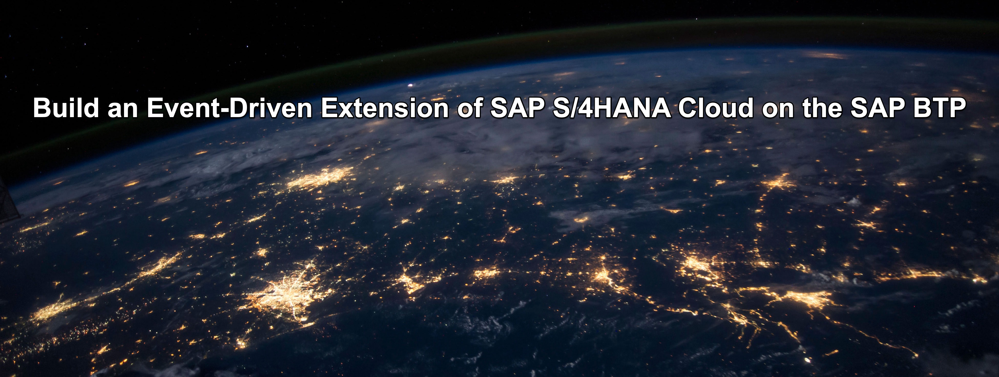
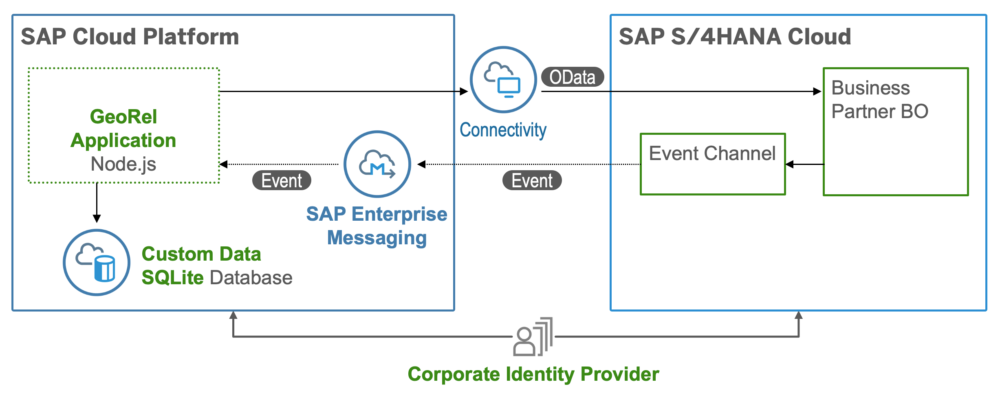

# Build an Event-Driven Extension of SAP S/4HANA Cloud

## Description

Extend SAP S/4HANA Cloud on the SAP Business Technology Platform using state of the art methodologies and technologies. Put an event-driven architecture into action and use the Cloud Application Programming Model (CAP) building on S/4 events and SAP Event Mesh as event broker.

The main intent of this scenario is to complement an existing business process in an SAP solution, i.e. enhancing SAP S/4HANA Cloud with additional business process steps. This involves adding major logic and/or additional data and goes beyond simple UI changes. 

This scenario showcases:

- Building a side-by-side extension to SAP S/4HANA Cloud
- Setting up Eventing and consuming events from SAP S/4HANA Cloud via [SAP Event Mesh](https://help.sap.com/viewer/bf82e6b26456494cbdd197057c09979f/Cloud/en-US/df532e8735eb4322b00bfc7e42f84e8d.html)
- Consuming data via API calls from SAP S/4HANA Cloud 
- Developing an application on SAP Business Technology Platform using the [SAP Cloud Application Programming Model(CAP)](https://cap.cloud.sap/docs/)
- Implementing a SAP Fiori Elements UI

## Business Scenario

In specific focus regions, we would like to follow up with newly created customers or existing customers that have had their data updated in our SAP S/4HANA Cloud backend. External call center employees should do this follow up for us by contacting relevant customers by phone. At the same time, the call center employees have no access to our SAP S/4HANA system. We therefore provide a custom built extension application that is specifically designed and optimized for the task and that is supplied with relevant data in real time using an event-driven approach. 

**Current Position - What is the challenge?**

- Business Partner data available only in SAP S/4HANA system
- Call center personnel needs SAP S/4HANA access for their work
- No custom UI for specific geo marketing use case

**Destination - What is the outcome?**

- Changes in S/4HANA communicated via events in real time to extension application
- Custom extension application works independently from SAP S/4HANA
- Call center personnel only needs access to custom app

## Architecture

### Solution Diagram

The extension application is developed using the SAP Cloud Application programming Model (CAP) and runs on the SAP Business Technology Platform. It consumes platform services like SAP Event Mesh and the Connectivity Services. The events generated in SAP S/4HANA Cloud are inserted into an SAP Event Mesh queue created by CAP. The application consumes these events and inserts relevant business partners into the local database. The extensions application uses SAP S/4HANA APIs to read Business Partner data from the SAP S/4HANA Cloud system. 

## Requirements
* SAP S/4HANA Cloud system (release 1905 or newer)
* SAP Business Technology Platform Cloud Foundry global account (trial accounts are not supported)

### For local development you would require the following:
* [Node js](https://nodejs.org/en/download/)
* [Cloud Foundry Command Line Interface (CLI)](https://github.com/cloudfoundry/cli#downloads)
* [Visual Studio Code](https://code.visualstudio.com/download) or another suitable IDE or editor of your choice
* [SQLite ](https://sqlite.org/download.html)

### Entitlements

The application requires below set of SAP BTP Entitlements/Quota

| Service                           | Plan       | Number of Instances |
|-----------------------------------|------------|:-------------------:|
| SAP Event Mesh                    | default    |          1          |
| Cloud Foundry Runtime             |            |          1          |
| SAP S/4HANA Cloud Extensibility   | api-access |          1          |

## Configuration

### Step 1: [Setup SAP Business Technology Platform and S/4HANA Cloud](https://github.com/SAP-samples/cloud-extension-s4hana-cloud-business-process/blob/main/documentation/mission/Setup%20Cloud%20Platform%20and%20S4HANA/README.md)

### Step 3: [Prepare Development Environment and Install Application](./documentation/mission/Development%20Environment%20and%20Application/README.md)

### Step 4: [Configure and Run Application](documentation/mission/Configure%20and%20Run%20Example%20Application/README.md)

### Step 5: [Demo Script](documentation/mission/Demo%20Script)

## Known Issues

No known issues.

## How to Obtain Support

In case you find a bug, or you need additional support, please [open an issue](https://github.com/SAP-samples/cloud-extension-s4hana-cloud-business-process/issues/new) here in GitHub.

## License
Copyright (c) 2021 SAP SE or an SAP affiliate company. All rights reserved. This project is licensed under the Apache Software License, version 2.0 except as noted otherwise in the [LICENSE](LICENSES/Apache-2.0.txt) file.
