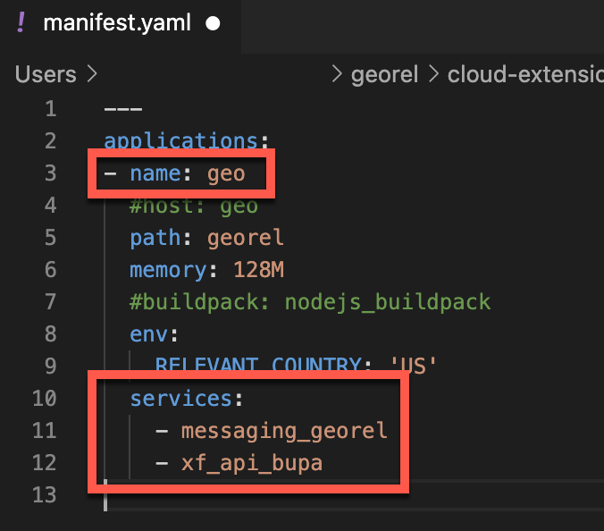
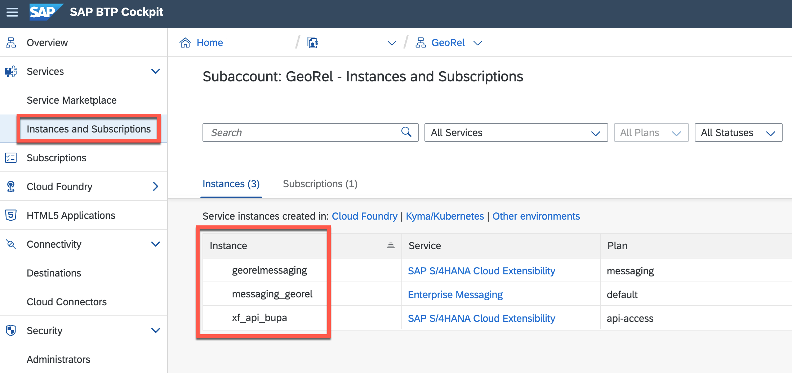
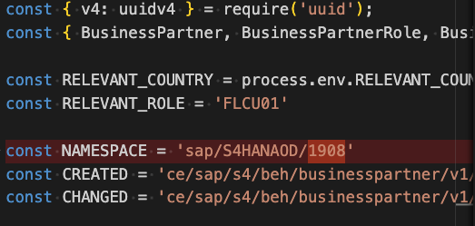
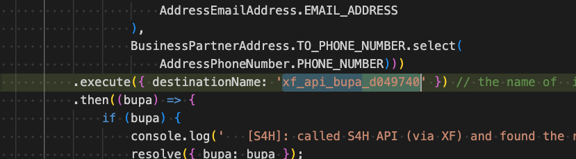
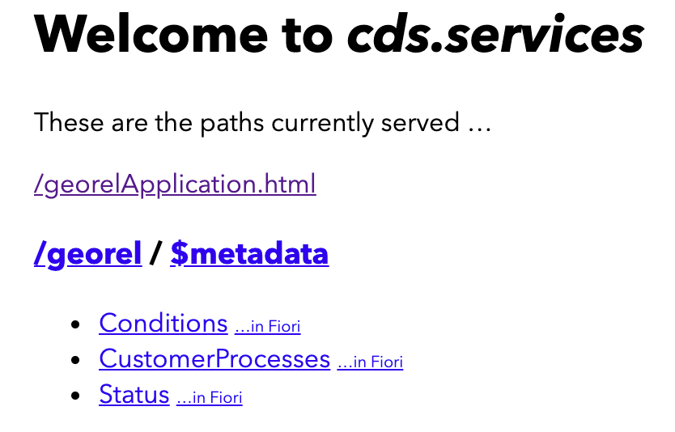

# Configuration

With the app coding ready on your device, you now need to perform a few steps to adjust the app to your own environment.
  
In detail you have to adapt the *manifest.yaml* and the *service.js* files.

1. Find the *manifest.yaml* in your installation folder , open it and perform the below
adjustments, if at all needed. Adjustments are only needed if you have adjusted the services names during the earlier steps or plan for using an app name without the random route option with the push command later on.

> **Note**
> Please change the value of **name** to `geo_your-d-number`. The value for the two services should also be adpated (i.e. `messaging_georel_your-d-number` and `xf_api_bupa_your-d-number`)

 
  
  In case you are wondering about the correct service names, you can look then up the SAP Business Technology Platform Cockpit.
  
 
  
2. In a next step go to >installation folder< /georel/srv and open the file service.js with the editor of your choice.

    

   
  
- Enter or adapt the constant for *NAMESPACE*. The namespace of the S/4HANA Cloud system has to be entered. This should be *sap/S4HANAOD/* plus the four character parameter you had picked in an earlier step.

HINT: Check *emClientId* in step 6 of Setup Connectivity and Extensibility --> SAP Business Technology Platform Cockpit: Create a new service instance of SAP S/4HANA Cloud Extensibility with service plan “messaging” for enterprise eventing integration if you have doubts in respect to the four character parameter.


# Deployment

We are going to use the command line client for the deployment. Make sure you have opened the Terminal in SAP Business Application Studio

To deploy the application perform the following steps:


1. Make sure you are logged into cf.
  
2. Navigate to the folder >installation folder</ and ensure you are in the folder that contains the *manifest.yaml* file. You can navigate using the cd .. command

3. Execute the following command: 

```
cf push --random-route
```

4. Check the console for the final output and that the deployment has worked out.

5. Check and remember the URL of your deployed app.

Example URL: *geo.cfapps.eu10.hana.ondemand.com*

> **Note** Using the command ```cf apps``` you can always look up this information

Note: replace “geo” with the host name which was entered in the *manifest.yaml* file.

6. Open the URL of your deployed app in a browser. Click on the hyperlink /georelApplication.html

 

# Execute Example Scenario

The application supports two scenarios. One is the creation of a new Business Partner in the SAP S/4HANA system, the other scenario is changing the data of an already existing Business Partner in the SAP S/4HANA system.

> **Note** The app might come with initial content. You should see the database preloaded with two business partners when initially starting the application.

## 1st scenario - Creation of a Business Partner in the SAP S/4HANA Cloud Backend

A new Business Partner is to be created in the SAP S/4HANA system by following below steps:

- Navigate to Business Partner Master
- Select Manage business partner Master Data
- Click on Create

For it to be shown in the app, the Business Partner must be located in the US and have role *FLCU01* assigned.

On top, the following properties of the business partner should be filled as well:

- FirstName
- LastName
- correspondanceLanguage 
- City
- PhoneNumber
- MailAddress

After the creation of the Business Partner a *BusinessPartner.created* event is fired that the app receives. As a payload the event contains the Business Partner ID. In a next step the app calls the appropriate OData service on the S/4HANA Cloud system, to obtain more information on the Business Partner.

Then the app checks if the Business Partner is located in the US and has role *FLCU01*. If yes, the app creates an entry in the database. This entry contains the additional information on the Business Partner. All of this happens in the background without the user noticing.

At this point, the application’s user interface needs to be manually refreshed to see the new entry in the list. Clicking on the entry allows to view the details, including technical information and URL of the specific Business Partner in the backend.
On the details page, there’s an *Edit* button which allows to switch to edit-mode. Fields for which the data retrieved from the backend are read-only. After customer care activities, the user of the app may change the customer status and processing status and these changes are stored in the database. The app automatically stores a draft of changes. After pressing save, the changes are written to the database

## 2nd scenario – Changes to a Business Partner in the SAP S/4HANA Cloud system

Whenever a Business Partner is updated in the SAP S/4HANA system, the app receives an event of *BusinessPartner.changed* type. If that Business Partner is already maintained in the app, then the backend data is updated. Like this, the app is always in sync with the SAP S/4HANA system in respect to the BusinessPartners.

# Run the Application

 

In order to test whether your setup works:

1. Start the application
2. Go to your SAP S/4HANA system and update or create a business partner that is located in the US and has the role *FLCU01*.
3. Refresh the overview page of your app.
4. The updated or created BusinessPartner should be listed.

 


