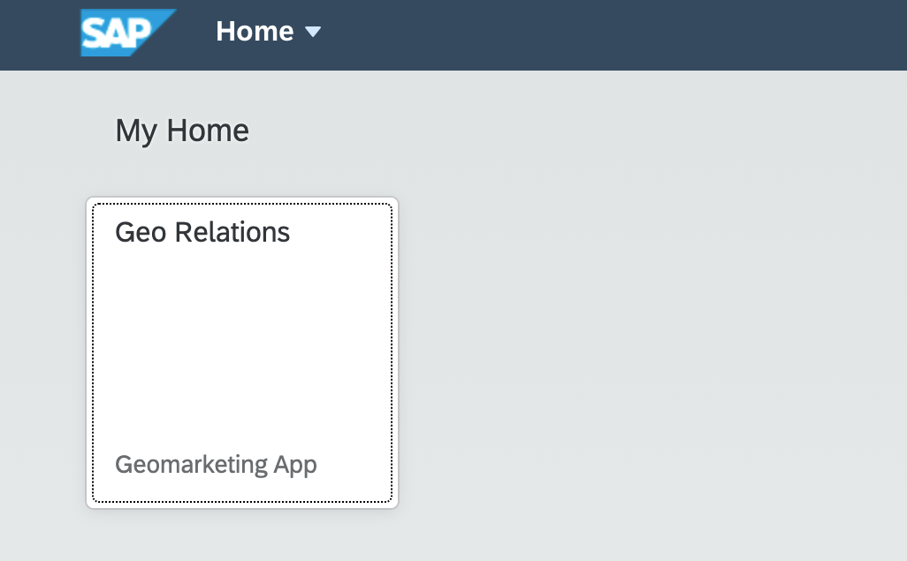
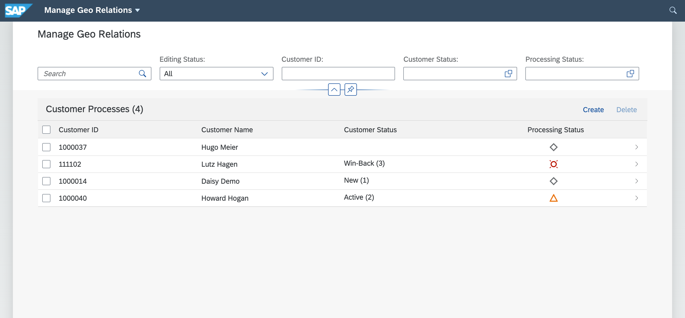
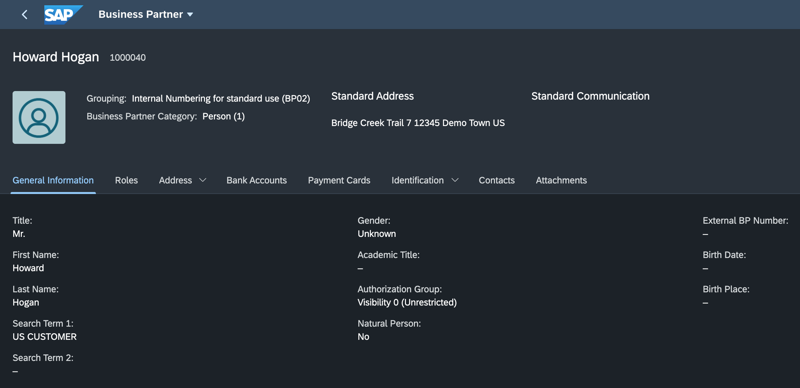
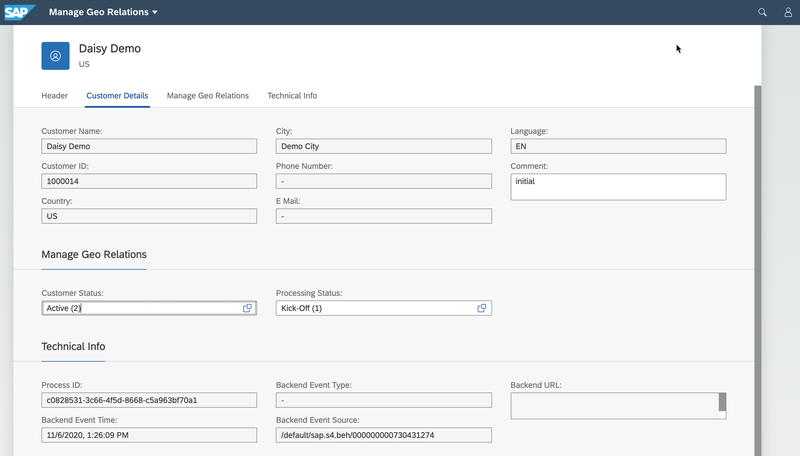

## Demo script

1. In the command line interface run the command `cf apps`
   
2. Find the URL for the Geo Relations app - this is the launch URL for the GeoRel application

3. Copy the URL into a browser and then click on the /georelApplication.html link

4. Click on tile for Geo Relations app

5. The list of Customer Process along with their status gets displayed

6. Login to the S/4HANA Cloud system

7. Go to the *Manage Business Partner Master Data* transaction 

8. Update/create a Business Partner with location US and role *FLC01*

9. Now go back to the Geo Relations application to see if the new Business Partner has been updated in the UI

10. Go to the details page for the new Business Partner. Click on *Edit*.

11. Check out the options that the GeoRel app offers like changing a status.

12. Play around with the app ...

