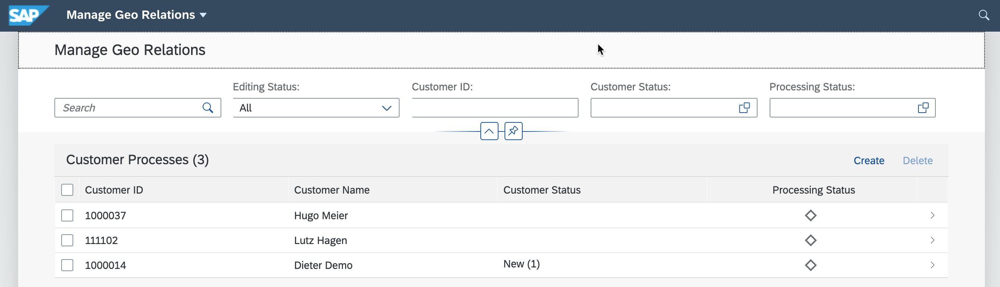

# Prepare Development Environment and Install Application

## Geo Relations Application

**Description**

The app allows to maintain customer relations for a specific region. Currently, “US” is the default which can be adapted via environment variables.

From a technology perspective, the application is written in javascript and running on node.js. It comes with an embedded SQLite database and new database content is stored in a local file on the cloud.

 

**Installation**

Either clone the code from GitHub or download and extract the ZIP file provided to your local file system >your installation folder<.
  
Navigate into the folder in which the package.json is located, which should be >your installation folder</georel

Run the three commands below:

```
npm install

npm install sqlite3 -D

cds deploy --to sqlite
```

Hint: In case of issues/errors, please make sure that your node installation is up to date. Specifically in case of issues installing sqlite3 on a Mac you could try: 

```
npm install -g npm@latest 

npm install sqlite3 -g npm@latest
```

