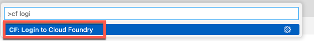

# Prepare Development Environment and Install Application

## Geo Relations Application

**Description**

The app allows to maintain customer relations for a specific region. Currently, “US” is the default which can be adapted via environment variables.

From a technology perspective, the application is written in javascript and running on node.js. It comes with an embedded SQLite database and new database content is stored in a local file on the cloud.

 

**Installation**

1. First you need to open SAP Buisess Application Studio. In Subaccount go to **Services** &rarr; **Instances and Subscriptions** and choose **SAP Business Application Studio** to open

 

2. Then choose **Create Dev Space**

 

3. Give a Dev Space name e.g. GeoRel_YourUserNumber and choose **Full Stack Cloud Application** Then choose **Create Dev Space**

 

4. Then you need to clone the provided code form GitHub. Choose **Clone from Git** and enter the link to the repo: https://github.com/SAP-samples/cloud-extension-s4hana-cloud-business-process

 

make sure you checkout to branch **learning-session**.

5. You can log into Cloud Foundry using the command pallette option. Choose **View** &rarr; **Command Palette**. In the entry section search and choose **Login to Cloud Foundry**

 
 

6. Specify the information for your cf environment. Enter your **API Endpoint** and choose authentication method **SSO Passcode**. Open the browser page to get your token and copy the generated toked to the field. Choose **Sign in**

 

7. Select the **Cloud Foundry Target** and select **Space**. Choose **Apply** 

 


8. Open the Terminal. Choose **Terminal** &rarr; **New Terminal**

  
9. In Terminal cavigate into the folder in which the package.json is located, which should be YourInstallationFolder/georel.  You can do this by running the command

```
cd georel
```


10. Run the three commands below:

```

npm install

npm install sqlite3

cds deploy --to sqlite

```
