# Setup Connectivity and Extensibility

## Register Your SAP S/4HANA Cloud System

To build extension applications for your SAP S/4HANA Cloud system, you need to connect your SAP S/4HANA Cloud system to your SAP Business Technology Platform global account.

To be able to do this, in respect to authorizations you must be: 

- an administrator of the SAP Business Technology Platform global account 

- an administrator of the SAP S/4HANA Cloud system. 

### SAP Business Technology Platform

1. In your SAP Business Technology Platform Cockpit, open your global account and choose
*Systems*.

2. In the Systems panel, choose *Register System*.


 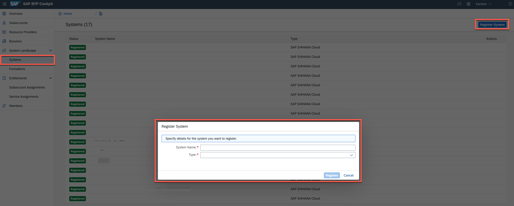


3. In the *Register System* dialog box, enter a name for the SAP S/4HANA Cloud system you want to connect.

- Recommendation: use a name that uniquely identifies this system, for example, system ID.
- Example: >S/4HANA Cloud system name<

4. In the Type dropdown list, choose *SAP S/4HANA Cloud*.

5. Choose *Register*.

 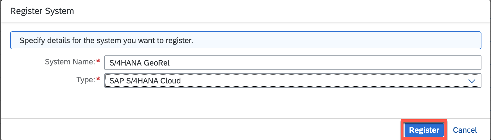

6. The SAP Business Technology Platform generates an integration token so the SAP S/4HANA Cloud system administrator can configure integration with the SAP Cloud Platform from your SAP S/4HANA Cloud system.
 
7. Copy the integration token and close the dialog box.

 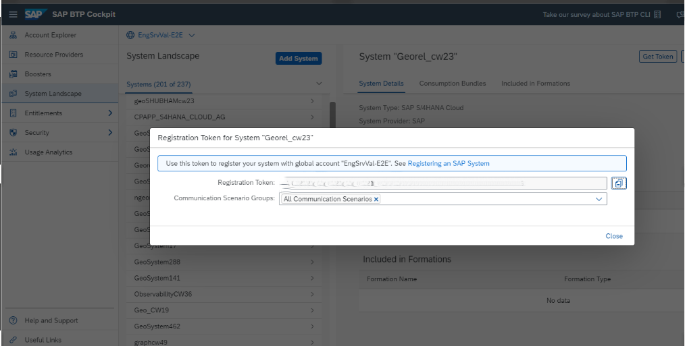

### SAP S/4HANA Cloud

1. Log onto your SAP S/4HANA Cloud tenant.

2. Navigate to *Home -> Communication Management* tab and choose the tile *Maintain SAP Cloud Platform Extensions*.

 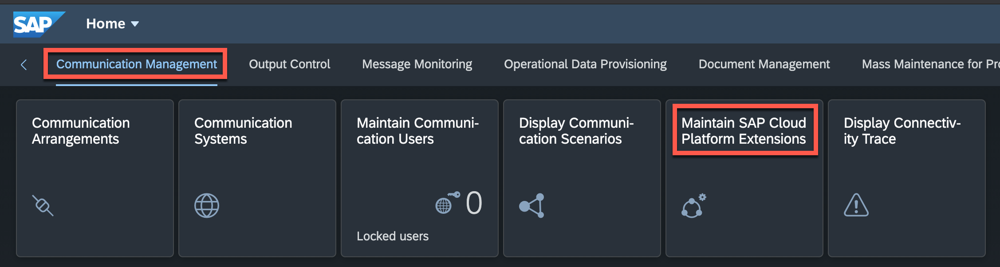

3. On the *Maintain SAP Cloud Platform Extensions* screen in the Integration section, choose *New*.

 

4. In the Integration Token field, paste in the integration token generated and copied from the SAP Business Technology Platform.

 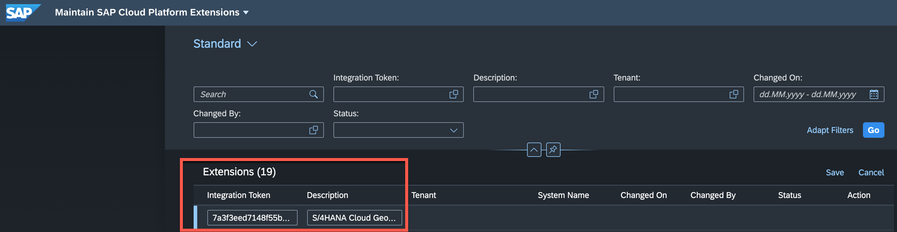

5. Enter a description for your system integration token.

- Recommendation: use the same name you entered in SAP Business Technology Platform when you generated the token.
- Example: >S/4HANA Cloud system name<

6. Choose *Save*.

- A new entry is displayed for your system in the table with the status *Enabling*.
- Wait for a few seconds.
- After the automated integration, the status of your system integration changes to *Enabled*.
- The same takes place on the SAP Business Technology Platform side. You will see the system as *Registered* – potentially after a quick refresh.


## Set Up Entitlements for Your Subaccount

After you have connected the SAP S/4HANA Cloud system (with status *Enabled* in your SAP S/4HANA Cloud tenant) to the SAP Business Technology Platform, you need to configure entitlements to make this system accessible in the SAP Business Technology Platform subaccount in which you want to build your extension application.

In the next steps you will configure the entitlements and assign the corresponding quota and service plans to the subaccount in which the extension application will reside.

Hint: Please note that as a prerequisite both a subaccount with Cloud Foundry enabled and a space need to have been created. In case you have not created a subaccount or a space yet, follow the instructions given in the documentation. 

So in case that you have no subaccount in place you would roughly have to follow these steps:

1. Create a Subaccount

2. Enable Cloud Foundry

3. Create a Space

Detailed Instructions can be found here:

https://help.sap.com/viewer/65de2977205c403bbc107264b8eccf4b/Cloud/en-US/05280a123d3044ae97457a25b3013918.html?q=subaccount

https://help.sap.com/viewer/65de2977205c403bbc107264b8eccf4b/Cloud/en-US/2f6ed22ccf424dae84345f4500c2d8ea.html

### SAP Business Technology Platform

1. In your SAP Business Technology Platform Cockpit, open your global account and choose *Entitlements --> Subaccount Assignments*.

 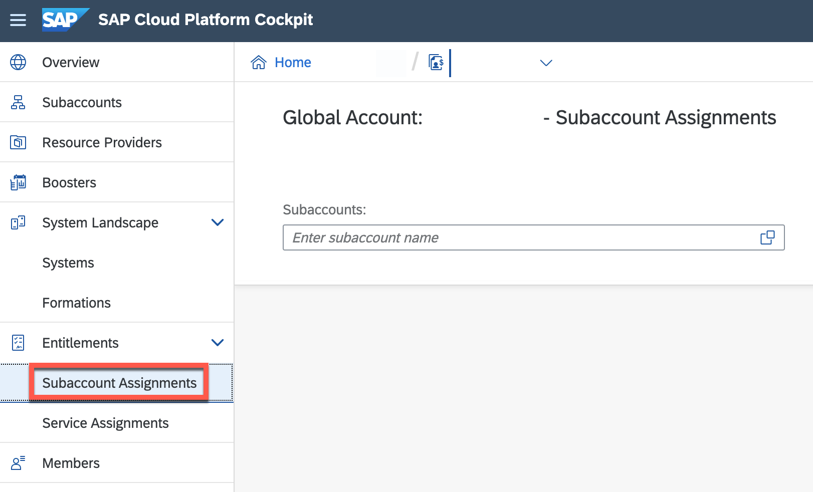


2. In the Subaccounts dropdown list, select your subaccount and choose *Ok*.
 
3. Choose *Configure Entitlements* and then *Add Service Plans*.

 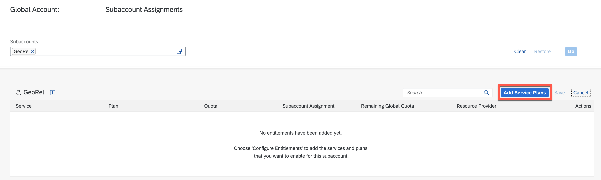


4. In the Subaccount Entitlements dialog box, select the service *SAP S/4HANA Cloud Extensibility*

 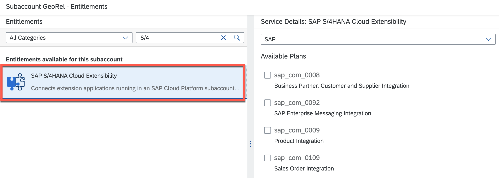


5. In the *Service Details: SAP S/4HANA Cloud Extensibility* screen area, select your newly registered system name from the dropdown help to list the available service plans. These available service plans are:

- *messaging* to consume SAP S/4HANA Cloud events and create event-based extensions using the event bus from SAP Event Mesh
- *api-access* for generic access to SAP S/4HANA Cloud APIs

 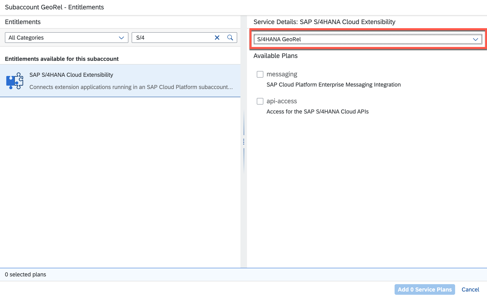


6. Select both service plans and press the *Add 2 Service Plans* button to add these entitlements for the SAP S/4HANA Cloud Extensibility service for your SAP S/4HANA Cloud system registered to your subaccount.

7. Press *Save*.

 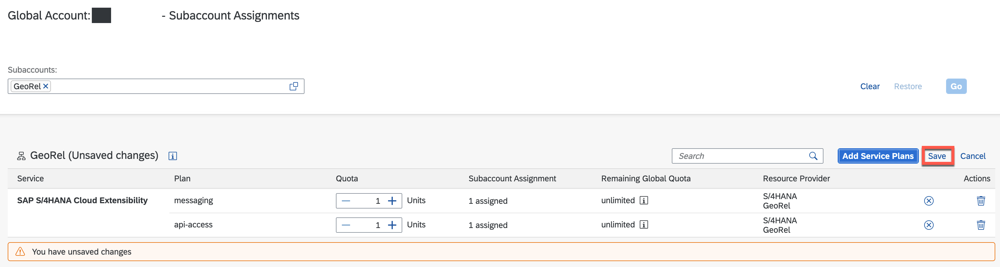


**Set up your subaccount entitlement for SAP Event Mesh**

1. Click on *Configure Entitlements* and then on *Add Service Plan*

2. In the *Subaccount Entitlements* dialog box, select the service *Event Mesh*


 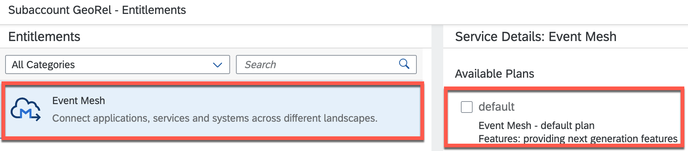


3. In the *Service Details: Event Mesh screen area*, select the *default* service plan

4. Press the *Add 1 Service Plan* button to add this entitlement for the Event Mesh service for your subaccount.

5. Press *Save*.


**Set up your subaccount entitlement for Cloud Foundry Runtime**

1. Click on *Configure Entitlements* and then on *Add Service Plan*.

2. In the *Subaccount Entitlements* dialog box, select the service *Cloud Foundry Runtime*

 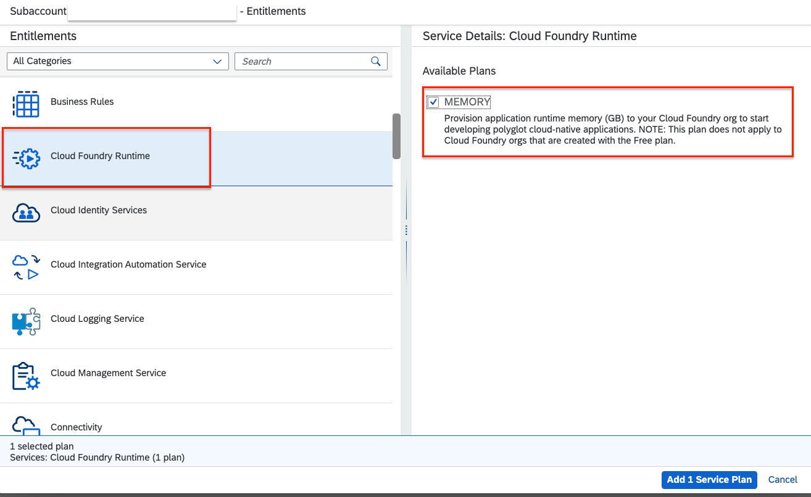


3. In the *Service Details: Cloud Foundry Runtime* screen area, select the following service plan:

- MEMORY

4. Press the *Add 1 Service Plan* button to add this entitlement for the Cloud Foundry Runtime service for your subaccount.

5. Press *Save*.

**Check**

Your activities should result in a screen like this:

 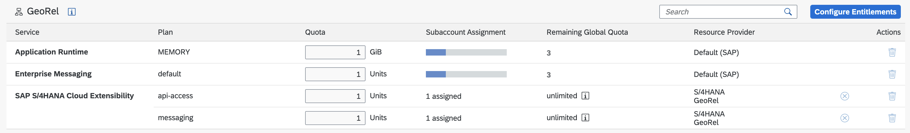


# Create Service Instances of SAP S/4HANA Cloud Extensibility Service with Service Plans

To allow SAP Business Technology Platform applications to consume events and APIs from SAP S/4HANA Cloud, you need to create the relevant service instances of SAP S/4HANA Cloud Extensibility for the service plans *api-access* and *messaging*.

**SAP BTP Cockpit:** Create a new service instance of SAP S/4HANA Cloud Extensibility with service plan *“messaging”* for enterprise eventing integration

1. Go to your subaccount and then to your space.

2. Go to the Service Marketplace and click on *SAP S/4HANA Cloud Extensibility*

 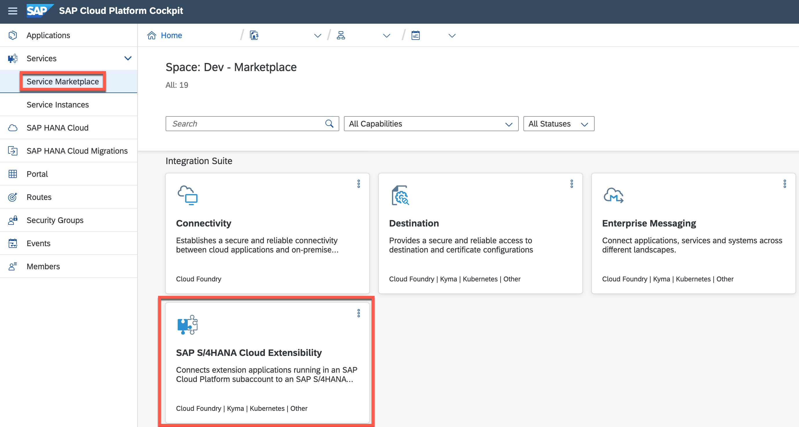


3. Click on *Create*.

 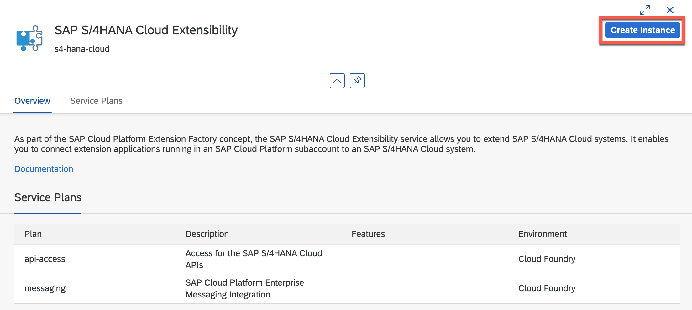

4. In the Create wizard in the Plan dropdown list, select the service *SAP S/4HANA Cloud Extensibility* with plan *messaging*. Choose a CLI friendly name for your instance (e.g. *georelmessaging*).

 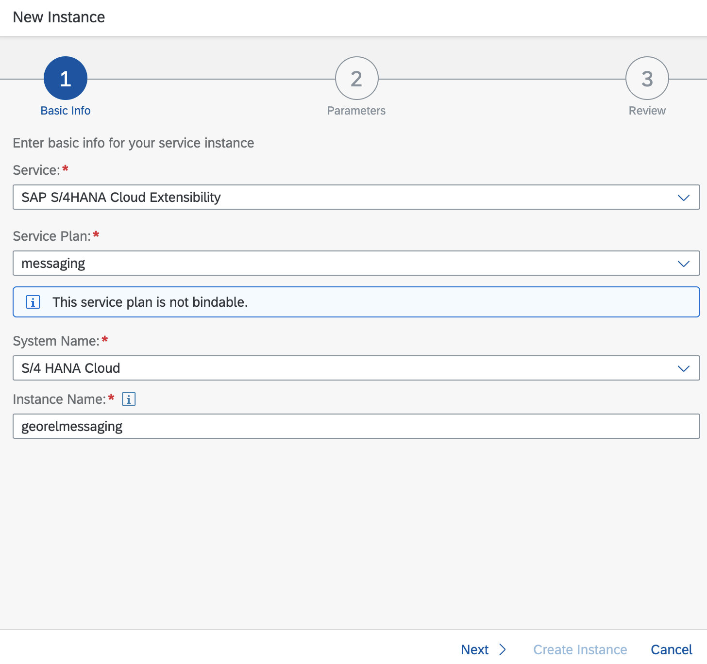
 
5. Click *Next*

6. In the Specify Parameters dialog box, use the following template, which should have
been prefilled for you.

- The *emClientId* you can freely choose following the conventions - unless it is already in use - and according to the conventions it must contain between 1 and 4 alphanumeric characters (a-z, A-Z, 0-9). Use for example your birthday (e.g. *1908*).
- Maintain the channel name as you will need this information when you enable events in your SAP S/4HANA Cloud system
- For more information, check on help.sap.com: https://help.sap.com/viewer/65de2977205c403bbc107264b8eccf4b/Cloud/en-US/5722fc4466cb43c1aae9625742185b64.html


``` 
{

"emClientId": "<Add your emClientId here>", 
  
"systemName": "<S/4HANA Cloud system name>"

}
``` 

 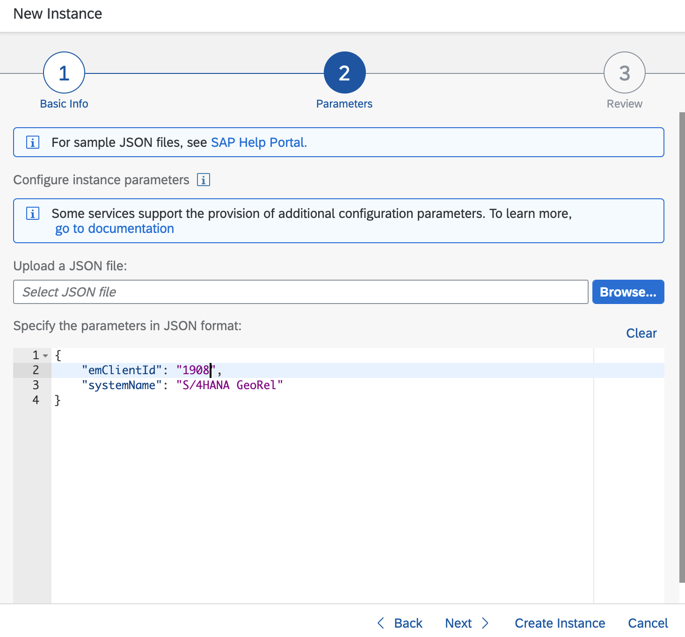


7. Click *Create Instance*. The newly created instance appears in the list of instances in the Instance panel.

**SAP Business Technology Platform Cockpit:** Create a new service instance of SAP S/4HANA Cloud Extensibility with service plan *api-access* to access the BusinessPartner API and enable its usage

1. Go to your subaccount and then to your space.

2. Go to the Service Marketplace and click on SAP S/4HANA Cloud Extensibility

3. Click on *Create*.

4. In the *Create wizard* in the Service dropdown list, select the service *SAP S/4HANA Cloud Extensibility*.

5. Select the Service Plan *api-access*, which you use for generic access to APIs in your SAP S/4HANA Cloud system.

   Use **xf_api_bupa** for your instance name.


 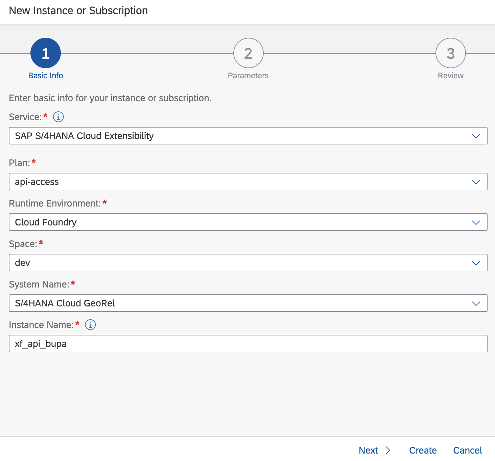

6. Click Next

7. In the Specify Parameters dialog box, you need to copy the template below and paste it into that box – replacing the content filled in there automatically

 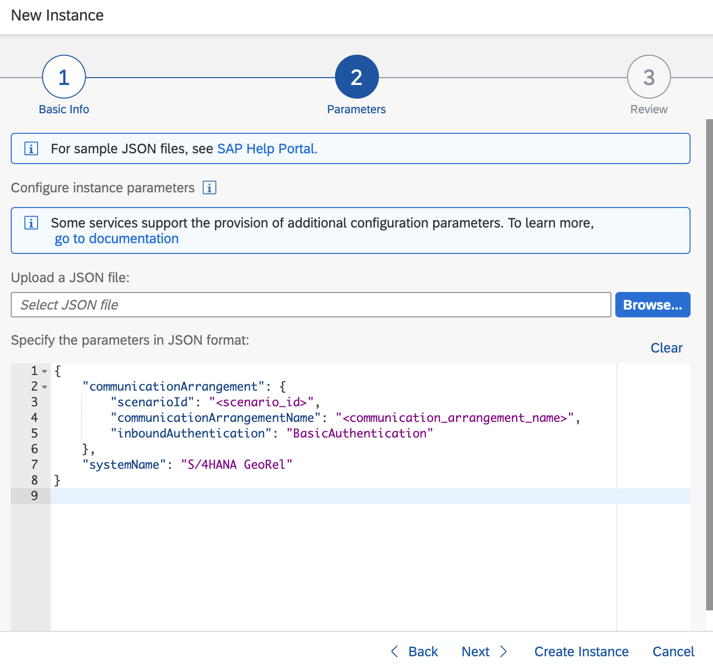

8. Copy the template below (please watch for line breaks)

- As “systemName” you must enter the name of your newly registered system. The system name should be prefilled in the content you are replacing - so you can just copy it to an editor before and the just copy it back into the template.
- As “communicationArrangementName” you must enter a speaking name for your communication arrangement.

```
{
    "systemName": "<SYSTEM NAME>",
    "communicationArrangement": {
        "communicationArrangementName": "<ARRANGEMENT NAME>",
        "scenarioId": "SAP_COM_0008",
        "inboundAuthentication": "BasicAuthentication",
        "outboundAuthentication": "BasicAuthentication",
        "outboundServices": [
            {
                "name": "Replicate Customers from S/4 System to Client",
                "isServiceActive": false
            },
            {
                "name": "Replicate Suppliers from S/4 System to Client",
                "isServiceActive": false
            },
            {
                "name": "Replicate Company Addresses from S/4 System to Client",
                "isServiceActive": false
            },
            {
                "name": "Replicate Workplace Addresses from S/4 System to Client",
                "isServiceActive": false
            },
            {
                "name": "Replicate Personal Addresses from S/4 System to Client",
                "isServiceActive": false
            },
            {
                "name": "Business Partner - Replicate from SAP S/4HANA Cloud to Client",
                "isServiceActive": false
            },
            {
                "name": "Business Partner Relationship - Replicate from SAP S/4HANA Cloud to Client",
                "isServiceActive": false
            },
            {
                "name": "Business Partner - Send Confirmation from SAP S/4HANA Cloud to Client",
                "isServiceActive": false
            },
            {
                "name": "BP Relationship - Send Confirmation from SAP S/4HANA Cloud to Client",
                "isServiceActive": false
            }
        ],
        "communicationSystem": {
            "communicationSystemHostname": "default.com",
            "outboundCommunicationUser": {
                "username": "DefaultUser",
                "password": "DefaultPassword"
            }
        }
    }
}
```

For more information, check:

https://help.sap.com/viewer/7b98ddc13f8d4a3ba08a74042a0baa7f/Cloud/en-US/553a4c6b98be4c1ba7d1dfa0e9df8669.html


8. Choose Next.

9. Click *Create*.


The newly created instance appears in the list of instances in the Instance panel.

 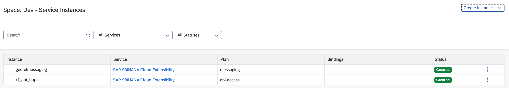


# Manage Your Solution for Event Handling in SAP S/4HANA Cloud System

You need to enable the events that are to be sent from your SAP S/4HANA Cloud system to SAP Business Technology Platform. For this enablement step, go to your SAP S/4HANA system.


**SAP S/4HANA Cloud: Maintain Event Topics for a Channel**

Find additional information here:

https://help.sap.com/viewer/7dde0e0e3a294f01a6f7870731c5e4ad/SHIP/en-US/1aafa0717c08461ba05ee846caec46b7.html

1. Log onto your SAP S/4HANA Cloud system

2. Go to Enterprise Event Enablement


 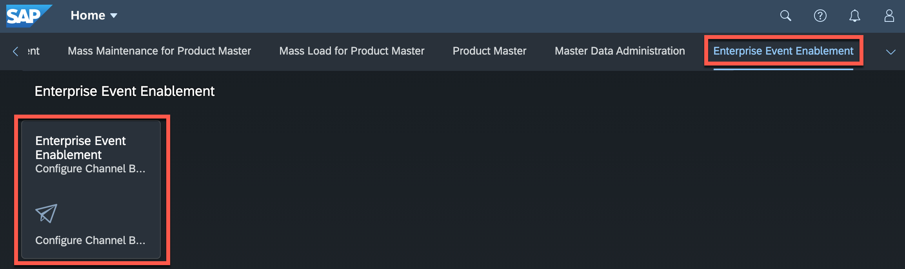


3. Click Go

4. Select your event channel from the list


 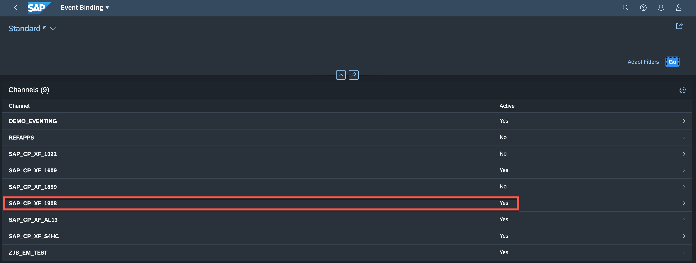


5. Click Create for your Outbound Topic


 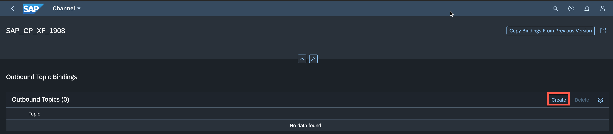


6. Click on the Topic selector

7. Enter *BusinessPartner* into the Topic Filter


 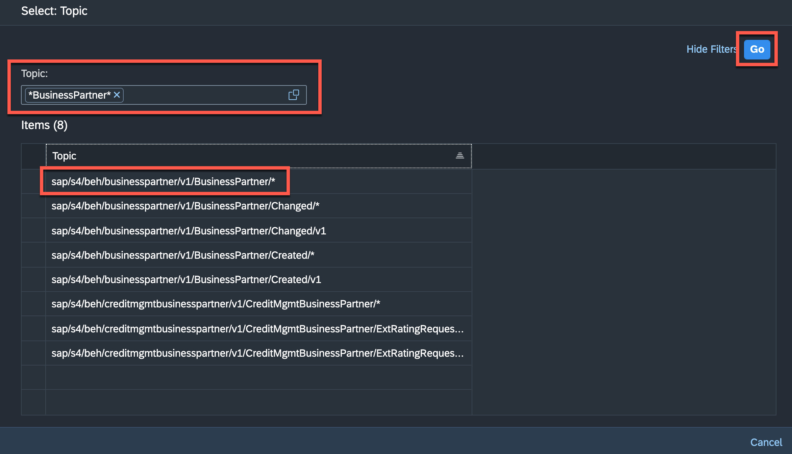


8. Click Go

9. Select BusinessPartner/*


 


10. Click Save.

# Create Event Mesh Instance

**SAP Business Technology Platform:** Create a new service instance for SAP Enterprise Messaging

When you create a new service instance for SAP Event Mesh, you create a new messaging client, which then receives events sent from your registered SAP S/4HANA Cloud system. The parameters you enter in the JSON file are the service descriptors that are later visible on the Messaging Client UI and dictate the rules to be used for creating queues and their subscriptions.

1. Go to the SAP Business Technology Platform Cockpit.

2. Open your subaccount and then your space (in which you want to create the service instance).

3. In the Navigation area, choose *Services* --> *Service Marketplace*

4. Choose the *Enterprise Messaging* tile.


 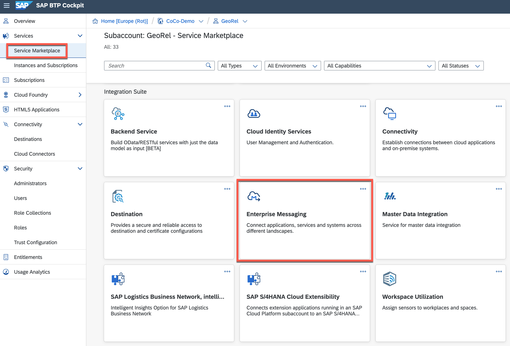


5. Click on *Create*.

6. Select *Enterprise Messaging* from the Service Drop Down

7. Select *default* from the Service Plan Drop Down

8. Enter the *Instance Name:* use *messaging_georel* for the instance name


 


9. Click *Next*

10. Copy the template into the parameter field and adjust relevant data:

- Line 3: emname
- Line 11 and 16: namespace

Example:

```
{

"emname": "EMGeo",
"namespace": "sap/georelations/1", "version": "1.1.0",
"options": {
"management": true, "messagingrest": true, "messaging": true
}, "rules": {
"queueRules": { "publishFilter": [
"${namespace}/*"
], "subscribeFilter": [
"${namespace}/*", "sap/S4HANAOD/1908/*"
] },
"topicRules": { "publishFilter": [
"${namespace}/*"
], "subscribeFilter": [
"${namespace}/*", "sap/S4HANAOD/1908/*"
] }

} 
}
```

In case of it being unclear what namespace to use you can look it up in the SAP S/4HANA Cloud system. Go to the event channel configuration as described above in the S/4 configuration section and find the relevant topic space there.

11. Click on *Create Instance*.

12. Once the instance has been created you can check on it in the SAP Business Technology Platform Cockpit


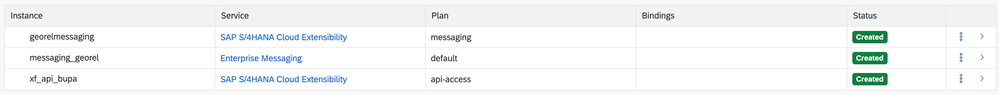


# Enable Event Mesh Cockpit (Optional)

In case that you would like to access the Event Mesh Cockpit, you need to subscribe to SAP Event Mesh and assign a number of roles to your user.

Hint: There is no need to access the SAP Event Mesh Cockpit in this scenario, it would allow for a better understanding though. Plus that it allows you to explore the event format etc.

1. Subscribe to Event Mesh

- Select *Subaccount*
- Select *Service Marketplace* → *Enterprise Messaging* → *Create*


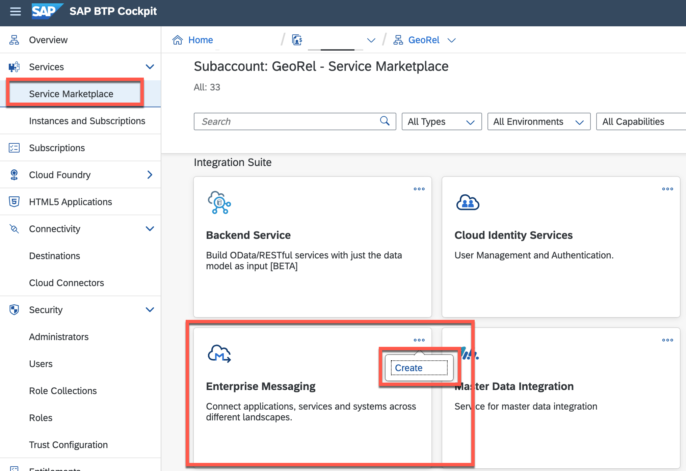

Hint: You can either click on the tile and select *Create* or select *Create* from the menu of the tile

Note: If you don't see the Enterprise Messaging tile or the Subscription option, get in contact with the administrator of the Global Account

2. Go through the subscription process and select *standard* Subscription from the list


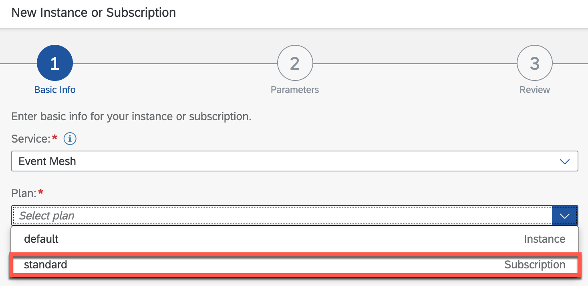


Once the subscription is completed you'll find additional Role Collections for Enterprise Messaging available in your subaccount.
 
3. Assign newly created role collections to your users

- Select *Subaccount*
- Select *Security* → *Trust Configuration*
- Click on your identity provider (e.g. SAP ID Service)
 
4. Provide email address of user to access eventing UIs
  
5. Click *Show Assignments*

6. Click *Assign Role Collection*

7. Select the Role Collection called *Enterprise Messaging Developer* from the drop-down and click *Assign Role Collection*

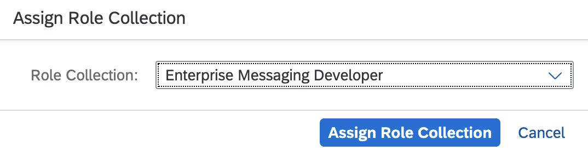

Repeat this for every user that needs to have access.

8. Click on your subaccount

9. Select the *Instances and Subscriptions* tab

10. Click on the three dots under subscriptions and behind your application

11. Select *Go to Application*

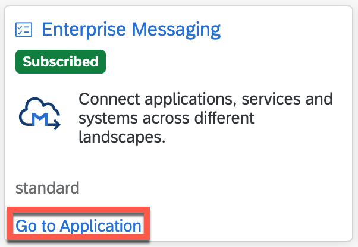

12. Go to the Event Mesh Cockpit and confirm it works


